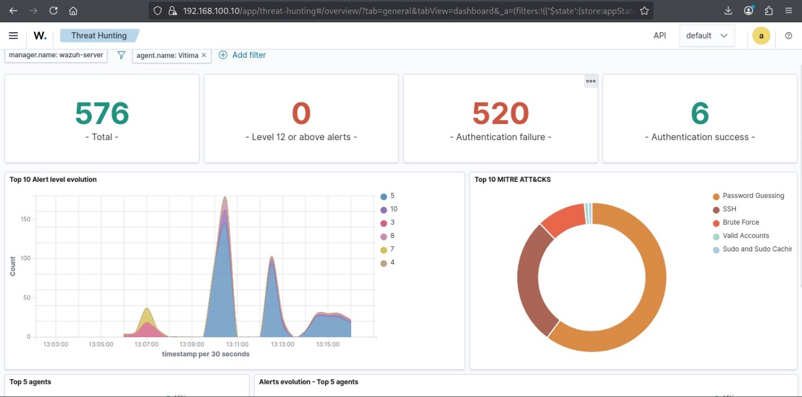
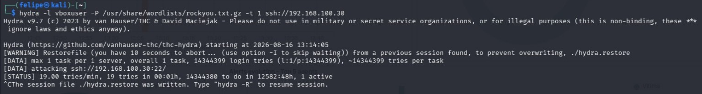
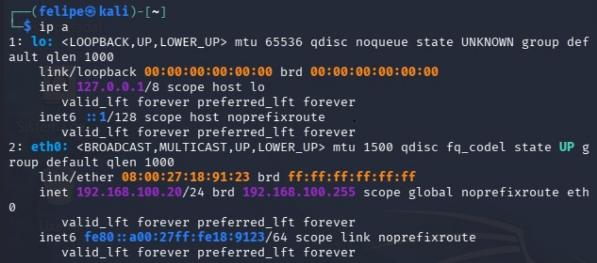
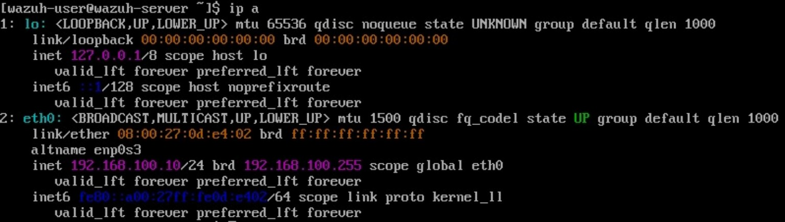
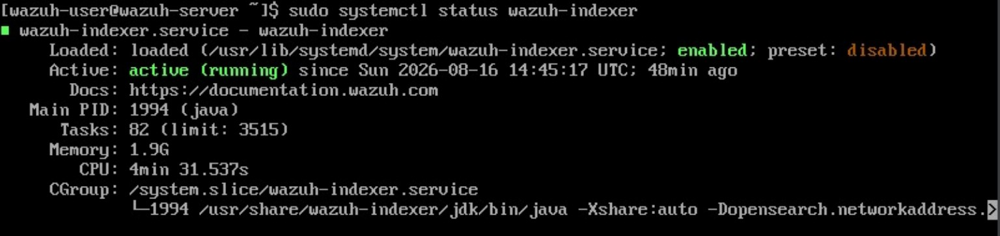

# 🛡️ SOC Lab Wazuh— Wazuh Threat Detection

Laboratório de cibersegurança desenvolvido para simular um ambiente de **SOC / Blue Team**, utilizando três máquinas virtuais para representar uma infraestrutura monitorada, uma máquina atacante e uma plataforma central de segurança.

O projeto demonstra o fluxo:

**Simulação de ataque → geração de logs → coleta pelo Wazuh → detecção → análise → classificação do incidente**

> **Aviso:** todo o cenário foi realizado em ambiente virtualizado e controlado, destinado exclusivamente a estudo e treinamento.

## 🎯 Objetivos

- Montar um laboratório semelhante a um ambiente de SOC;
- Configurar o Wazuh para monitoramento;
- Simular tentativas de autenticação SSH contra uma máquina vítima;
- Observar falhas e sucessos de autenticação;
- Analisar os eventos no dashboard do Wazuh;
- Relacionar os eventos a técnicas do MITRE ATT&CK;
- Praticar triagem e documentação de incidentes.

## 🏗️ Arquitetura

| VM | Sistema | Função | IP |
|---|---|---|---|
| Wazuh Server | Ubuntu | SIEM / monitoramento | `192.168.100.10` |
| Kali Linux | Kali Linux | Máquina de simulação do ataque | `192.168.100.20` |
| Vítima | Ubuntu | Endpoint monitorado | `192.168.100.30` |

```text
                    ┌─────────────────────────┐
                    │      Wazuh Server       │
                    │         Ubuntu          │
                    │      192.168.100.10     │
                    └────────────┬────────────┘
                                 │
                         Coleta / Análise
                                 │
              ┌──────────────────┴──────────────────┐
              │                                     │
      ┌───────▼────────┐                    ┌───────▼────────┐
      │   Kali Linux   │                    │     Vítima     │
      │    Atacante    │────── SSH ────────►│     Ubuntu     │
      │ 192.168.100.20 │                    │ 192.168.100.30 │
      └────────────────┘                    └────────────────┘
```

## 🔴 Cenário simulado

Foi realizada uma simulação controlada de múltiplas tentativas de autenticação SSH contra a máquina vítima.

O comportamento gerou eventos de autenticação que foram coletados e apresentados pelo Wazuh para análise.

No dashboard foram observados:

- **576 eventos totais**
- **520 falhas de autenticação**
- **6 autenticações bem-sucedidas**
- **0 alertas de nível 12 ou superior**

O dashboard também apresentou categorias relacionadas a:

- Password Guessing
- Brute Force
- SSH
- Valid Accounts
- Sudo and Sudo Caching

## 🔎 Fluxo de análise

```text
Geração do evento
       ↓
Coleta pelo Wazuh
       ↓
Detecção / correlação
       ↓
Triage do alerta
       ↓
Identificação da origem e destino
       ↓
Classificação do incidente
       ↓
Resposta
       ↓
Documentação e encerramento
```

## 📁 Estrutura do projeto

```text
soc-wazuh-lab/
├── README.md
├── docs/
│   ├── arquitetura.md
│   ├── simulacao-ataque.md
│   ├── analise-incidente.md
│   └── resposta-incidente.md
├── evidence/
│   └── incident-report.md
├── screenshots/
│   ├── wazuh-dashboard.png
│   ├── kali-hydra.png
│   ├── kali-ip.png
│   ├── wazuh-server-ip.png
│   └── wazuh-indexer.png
└── .gitignore
```

## 📸 Evidências

### Dashboard do Wazuh



### Simulação no Kali Linux



### Endereçamento do Kali



### Endereçamento do Wazuh Server



### Serviço Wazuh Indexer



## 🧠 MITRE ATT&CK

A atividade simulada pode ser relacionada principalmente a:

| Técnica | Descrição |
|---|---|
| T1110 | Brute Force |
| T1110.001 | Password Guessing |
| T1021.004 | SSH |
| T1078 | Valid Accounts |

A associação definitiva deve considerar as regras e alertas efetivamente gerados pelo Wazuh durante a execução do laboratório.

## 🛠️ Tecnologias

- Wazuh
- Wazuh Indexer
- Ubuntu Server
- Ubuntu
- Kali Linux
- SSH
- Hydra
- Linux
- MITRE ATT&CK
- Virtualização

## 📚 Documentação

- [Arquitetura do laboratório](docs/arquitetura.md)
- [Simulação do ataque](docs/simulacao-ataque.md)
- [Análise do incidente](docs/analise-incidente.md)
- [Resposta ao incidente](docs/resposta-incidente.md)
- [Relatório do incidente](evidence/incident-report.md)

## 🚀 Possíveis melhorias

- Criar regras personalizadas no Wazuh;
- Configurar resposta automática;
- Integrar firewall;
- Implementar bloqueio automático de IP;
- Criar dashboards personalizados;
- Adicionar File Integrity Monitoring;
- Simular outros tipos de incidentes;
- Criar playbooks de resposta;
- Integrar automações de SOC.

## 👨‍💻 Área de estudo

**Cybersecurity | SOC | Blue Team | SIEM | Threat Detection | Incident Response**
